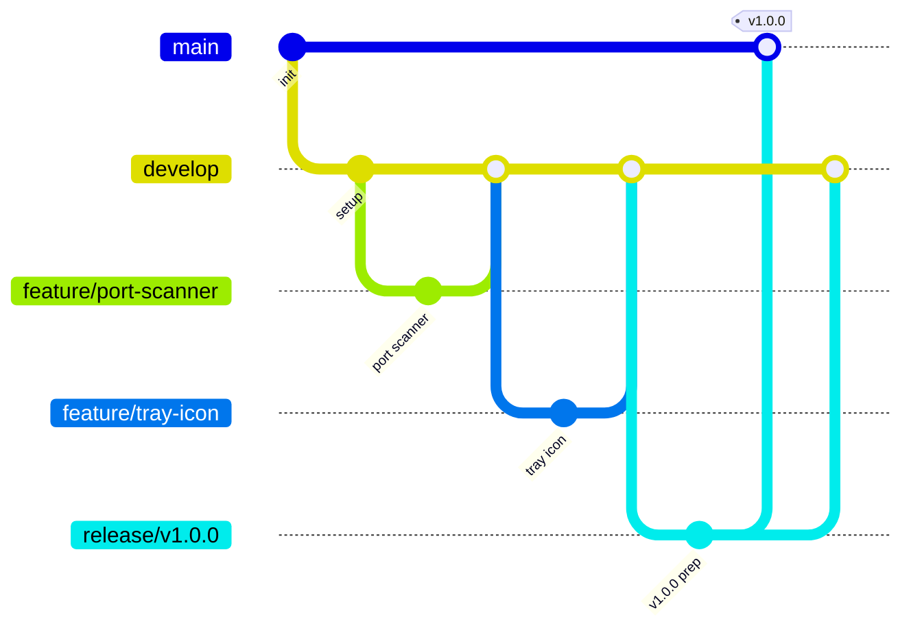

# PortPilot Development Plan
> Comprehensive development roadmap with version control, CI/CD, testing, and future enhancements.

---

## 1. Project Structure

```
portpilot/
├── .github/
│   └── workflows/
│       ├── ci.yml              # Linting, testing on all OS
│       ├── release.yml         # Build & publish releases
│       └── nightly.yml         # Optional: nightly builds
├── src/
│   ├── core/
│   │   ├── __init__.py
│   │   ├── version.py          # Centralized version string
│   │   ├── port_scanner.py     # psutil port mapping
│   │   ├── process_killer.py   # Process termination logic
│   │   └── tunnel_manager.py   # SSH tunnel subprocess management
│   ├── ui/
│   │   ├── __init__.py
│   │   ├── tray_icon.py        # QSystemTrayIcon main entry
│   │   ├── dashboard.py        # Main window (tabs)
│   │   ├── widgets/
│   │   │   ├── port_table.py   # Active ports table
│   │   │   └── tunnel_list.py  # Tunnel manager UI
│   │   └── styles/
│   │       └── dark_theme.qss  # Dark mode stylesheet
│   ├── utils/
│   │   ├── __init__.py
│   │   ├── config.py           # App configuration
│   │   ├── updater.py          # Auto-update logic
│   │   └── platform_utils.py   # OS-specific helpers
│   └── main.py                 # Application entry point
├── tests/
│   ├── unit/
│   │   ├── test_port_scanner.py
│   │   ├── test_process_killer.py
│   │   └── test_tunnel_manager.py
│   ├── integration/
│   │   ├── test_tray_integration.py
│   │   └── test_e2e_workflow.py
│   └── conftest.py             # pytest fixtures
├── resources/
│   ├── icons/
│   │   ├── tray_icon.png
│   │   ├── tray_icon.ico       # Windows
│   │   └── tray_icon.icns      # macOS
│   └── tunnels.json            # Default tunnel config template
├── scripts/
│   ├── build_windows.ps1
│   ├── build_macos.sh
│   └── build_linux.sh
├── docs/
│   └── USER_GUIDE.md
├── requirements.txt
├── requirements-dev.txt
├── pyproject.toml
├── setup.py
└── README.md
```

---

## 2. Version Control Strategy (GitFlow)

### Branch Structure
| Branch | Purpose | Lifecycle |
|--------|---------|-----------|
| `main` | Production-ready releases | Protected, merge via PR only |
| `develop` | Integration branch for features | Active development target |
| `feature/*` | New features (e.g., `feature/tunnel-manager`) | Merge → `develop` |
| `release/*` | Release prep (e.g., `release/v1.0.0`) | Merge → `main` + `develop` |
| `hotfix/*` | Production bug fixes | Merge → `main` + `develop` |

### Workflow


### Commit Convention
Use **Conventional Commits**:
- `feat:` New feature
- `fix:` Bug fix
- `docs:` Documentation
- `test:` Adding tests
- `refactor:` Code refactoring
- `chore:` Maintenance tasks
- `ci:` CI/CD changes

### Tagging Strategy
- Semantic Versioning: `vMAJOR.MINOR.PATCH`
- Pre-releases: `v1.0.0-alpha.1`, `v1.0.0-beta.1`, `v1.0.0-rc.1`

---

## 3. Development Phases & Timeline

### Phase 1: MVP "The Killer" (Weeks 1-3)
| Week | Milestone | Deliverables |
|------|-----------|--------------|
| 1 | Project Setup | Repo init, CI/CD skeleton, dev environment |
| 2 | Core Engine | `PortScanner`, `ProcessKiller` modules |
| 3 | MVP UI | System tray, dashboard table, kill functionality |

**Exit Criteria**: User can view ports and kill processes via tray app.

---

### Phase 2: "The Tunneler" (Weeks 4-6)
| Week | Milestone | Deliverables |
|------|-----------|--------------|
| 4 | Tunnel Core | `TunnelManager` module, `tunnels.json` persistence |
| 5 | Tunnel UI | Add/edit/delete tunnels, ON/OFF toggle |
| 6 | Integration | Visual indicators, tray menu tunnel status |

**Exit Criteria**: User can manage SSH tunnels with visual feedback.

---

### Phase 3: Polish & Multi-OS (Weeks 7-9)
| Week | Milestone | Deliverables |
|------|-----------|--------------|
| 7 | Polish | Auto-refresh, dark mode, admin privilege handling |
| 8 | Cross-Platform | macOS/Linux builds, platform-specific testing |
| 9 | Packaging | PyInstaller builds for all OS, GitHub releases |

**Exit Criteria**: Downloadable installers for Windows, macOS, Linux.

---

### Phase 4: Auto-Update & Release (Weeks 10-11)
| Week | Milestone | Deliverables |
|------|-----------|--------------|
| 10 | Auto-Update | GitHub release checker, download & install flow |
| 11 | v1.0.0 Release | Final testing, documentation, public release |

**Exit Criteria**: Production-ready v1.0.0 with auto-update.

---

## 4. Testing Strategy

### Unit Tests (pytest)
| Module | Test Coverage |
|--------|--------------|
| `PortScanner` | Mock `psutil.net_connections()`, verify port-to-process mapping |
| `ProcessKiller` | Mock `psutil.Process`, test kill + permission error handling |
| `TunnelManager` | Mock `subprocess`, test start/stop/persist logic |

### Integration Tests
| Test | Description |
|------|-------------|
| Tray Integration | Verify tray icon appears, menu populates correctly |
| E2E Kill Flow | Spawn test process → detect in UI → kill → verify termination |
| Tunnel Lifecycle | Add tunnel → start → verify connection → stop → cleanup |

### Manual QA Checklist
- [ ] Tray icon visible on Windows/macOS/Linux
- [ ] Dashboard opens from tray menu
- [ ] Port table populates with real system data
- [ ] Kill button terminates process (test with dummy process)
- [ ] Tunnel ON/OFF toggles work
- [ ] Dark mode renders correctly
- [ ] Auto-update downloads and installs new version
- [ ] Admin privilege prompt appears when needed (Windows UAC)

### Test Commands
```bash
# Run all tests
pytest tests/ -v --cov=src --cov-report=html

# Unit tests only
pytest tests/unit/ -v

# Integration tests only
pytest tests/integration/ -v

# Linting
ruff check src/ tests/
mypy src/
```

---

## 5. CI/CD Pipeline (GitHub Actions)

### Continuous Integration (`ci.yml`)
**Triggers**: Push to `develop`, `feature/*`, `release/*`, PRs

```yaml
jobs:
  test:
    strategy:
      matrix:
        os: [ubuntu-latest, macos-latest, windows-latest]
        python-version: ["3.13"]
    steps:
      - Checkout
      - Setup Python
      - Install dependencies
      - Run linting (ruff, mypy)
      - Run pytest with coverage
      - Upload coverage report
```

### Release Build (`release.yml`)
**Triggers**: Push tag `v*`

```yaml
jobs:
  build:
    strategy:
      matrix:
        include:
          - os: windows-latest
            artifact: PortPilot-Setup.exe
          - os: macos-latest
            artifact: PortPilot.dmg
          - os: ubuntu-latest
            artifact: PortPilot.AppImage
    steps:
      - Checkout
      - Setup Python
      - Install PyInstaller
      - Build executable
      - Sign (macOS/Windows)
      - Upload artifact

  release:
    needs: build
    steps:
      - Download all artifacts
      - Create GitHub Release
      - Attach binaries
      - Generate changelog
```

---

## 6. Multi-OS Build Strategy

| Platform | Packager | Output | Notes |
|----------|----------|--------|-------|
| **Windows** | PyInstaller | `.exe` installer | Use Inno Setup for installer |
| **macOS** | PyInstaller + `create-dmg` | `.dmg` | Code signing required for Gatekeeper |
| **Linux** | PyInstaller + AppImage | `.AppImage` | Portable, no install needed |

### Platform-Specific Considerations
- **Windows**: UAC elevation for killing system processes
- **macOS**: Request Accessibility permissions for process control
- **Linux**: May need `pkexec` for elevated privileges

---

## 7. Future Enhancements Roadmap

### v1.1 - Quality of Life
- [ ] Port grouping by application
- [ ] Favorite/pinned ports
- [ ] Custom refresh intervals
- [ ] Export port list (CSV/JSON)

### v1.2 - Network Insights
- [ ] Connection history logging
- [ ] Traffic statistics (bytes in/out)
- [ ] Network interface selector

### v1.3 - Advanced Tunnels
- [ ] SOCKS proxy support
- [ ] Auto-reconnect for dropped tunnels
- [ ] SSH key management

### v2.0 - Pro Features (Monetization)
- [ ] Multi-machine monitoring (agent-based)
- [ ] Cloud-synced tunnel configurations
- [ ] Team sharing & collaboration
- [ ] Web dashboard companion

### v2.x - Extended Platform
- [ ] Browser extension (port conflict warnings)
- [ ] CLI companion tool
- [ ] Docker container integration

---

## 8. Dependencies

### Production
```
PyQt6>=6.6.0
psutil>=5.9.0
```

### Development
```
pytest>=8.0.0
pytest-cov>=4.0.0
pytest-qt>=4.3.0      # PyQt testing
ruff>=0.1.0           # Linting
mypy>=1.8.0           # Type checking
pyinstaller>=6.0.0
```

---

## 9. Getting Started

```bash
# Clone repository
git clone https://github.com/logando-al/port_pilot.git
cd port_pilot

# Create virtual environment
python -m venv .venv
source .venv/bin/activate  # or .venv\Scripts\activate on Windows

# Install dependencies
pip install -r requirements.txt
pip install -r requirements-dev.txt

# Run application
python src/main.py

# Run tests
pytest tests/ -v
```

---

## 10. Success Metrics

| Metric | Target |
|--------|--------|
| Test Coverage | ≥80% |
| CI Build Time | <5 minutes |
| App Startup Time | <2 seconds |
| Memory Usage | <100MB idle |
| GitHub Stars | 100+ (first month) |

---

> **Ready to initialize the project?** Start with Phase 1, Week 1! 🚀
